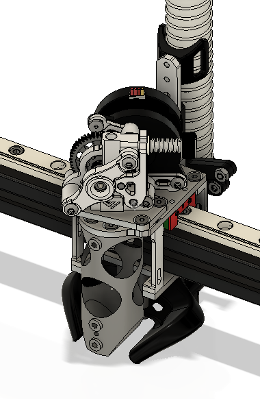

# VzBot-Chube-Toolhead
A toolhead for vzbot printers which allows the use of chube.

Without the watercooled vz-hextrudort it's recommended to use chube air. This repo is intended to be a new top plate that is used with the older vzbot parts to allow more surface area for chube to run fanless. Vz-hextrudort water + chube conduction will work here as the increased surface area.

This toolhead is untested as I don't have a vzbot.

